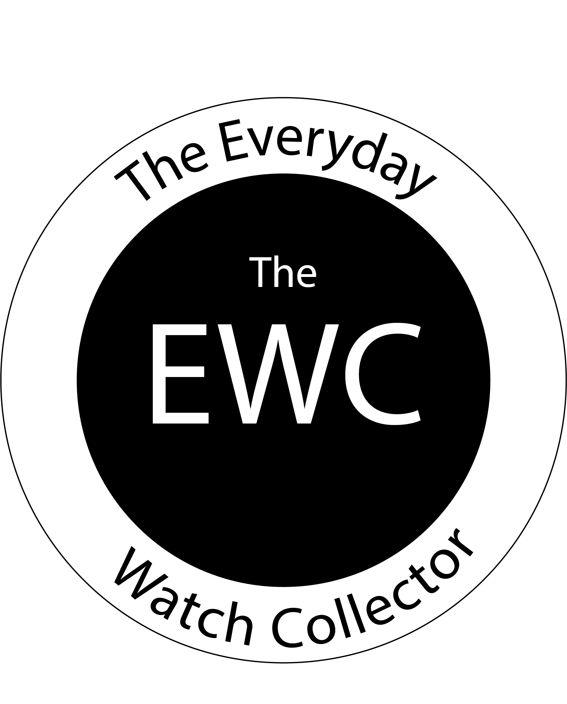

</a>
 
<h2 align="center"><b>The EWC</b></h2>
<h4 align="center">A 2-in-1 app displaying a glossary of watch terms and a videos list, all brought to you by <a href="https://www.youtube.com/channel/UCUeOzbW-N18IowOP4-HulIg">The Everyday Watch Collector (The EWC).</a></h4>

## Features

- 100+ Glossary entries of common watch terms
- Filter watch terms by category (brand, general)
- View community-sourced definitions
- 40+ Videos from The Everyday Watch Collector (THe EWC)
- Order videos chronologically
- Launch videos in browser

## Screenshots

   

## Features To Implement

- Improve navigation between pages (add back button)
- Enhance glossary experience with search
- Bookmark favourite glossary terms

## License
  

This project is licensed under the GNU General Public License v3.0.
